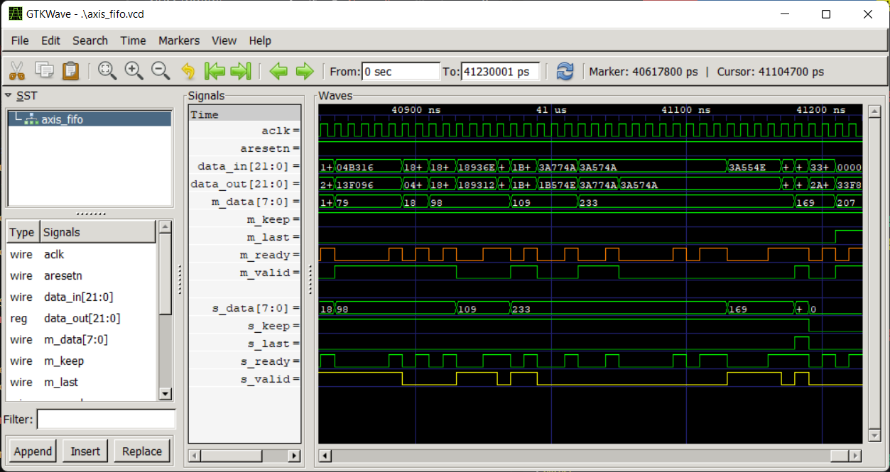

# Cocotb + Icarus Setup

[Cocotb](https://github.com/cocotb/cocotb) is an open-source python-based alternative to SystemVerilog testbenches. Since python is a productive high-level language with a rich ecosystem of well-maintained libraries such as numpy, tensorflow and pytorch, using python for verification allows the direct usage of those libraries. Cocotb does not simulate the testbench itself. Instead, it interfaces with any of the following simulators:

* Icarus-Verilog
* Verilator
* Synopsys VCS
* Cadence Incisive
* [and more](https://docs.cocotb.org/en/stable/simulator_support.html)

While Verilator is a fast & widely used open-source simulator, I could not find an easy way to install it in windows. Therefore, I will use icarus-verilog.

Cocotb-test is a pytest-based library that wraps around cocotb and simplifies the make system. Advantages are:

* Specifying makefile is also done in python
* Can run the same test with different parameters automatically

## Setup anaconda, install cocotb

Install anaconda from [here](https://docs.anaconda.com/anaconda/install/index.html). Then create an environment and install needed packages.

```
conda create --name verify
conda install numpy
pip install cocotb cocotb-test
```

## Install Icarus & GTKwave

* [Icarus download](https://bleyer.org/icarus/)
* [GTK download](http://gtkwave.sourceforge.net/) - just extract the zip

## Run example

Two example designs and corresponding testbenches have been developed:

1. _dff:_ A simple D flip flop
2. *axis_fifo:* AXI Stream FIFO tested with randomized ready, valid handshakes for different static parameters.

### Run all tests:

```
conda activate verify
pytest
```

### View Waveform

```
path/to/gtkwave.exe axis_fifo/sim_build/WIDTH=8,DEPTH=2/dff.vcd
```



### Github Actions (CI/CD Pipeline)

Github actions are defined in ```.github/workflows/verify.yml```. Currently they are defined to setup iverilog, cocotb on an ubuntu machine and run all tests, whenever a commit is pushed into any branch in origin. They also can be setup to trigger when a branch is merged into the master branch.

[Check past actions here](https://github.com/Lemurian-Labs/cocotb-example/actions)